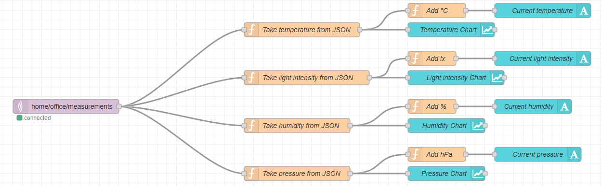
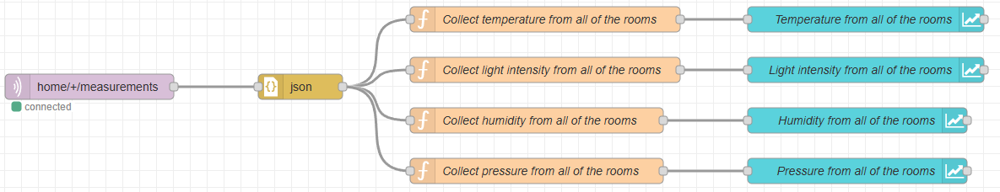
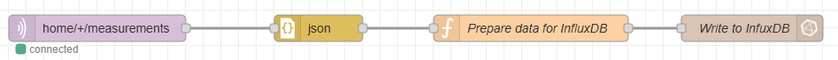
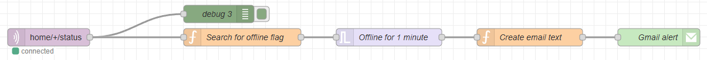
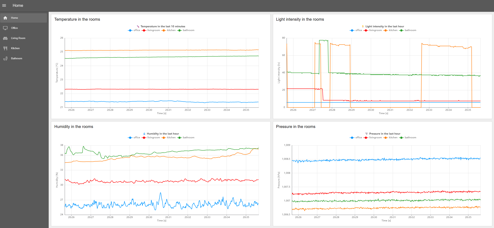
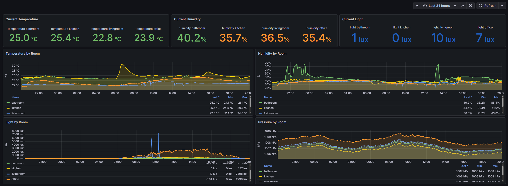
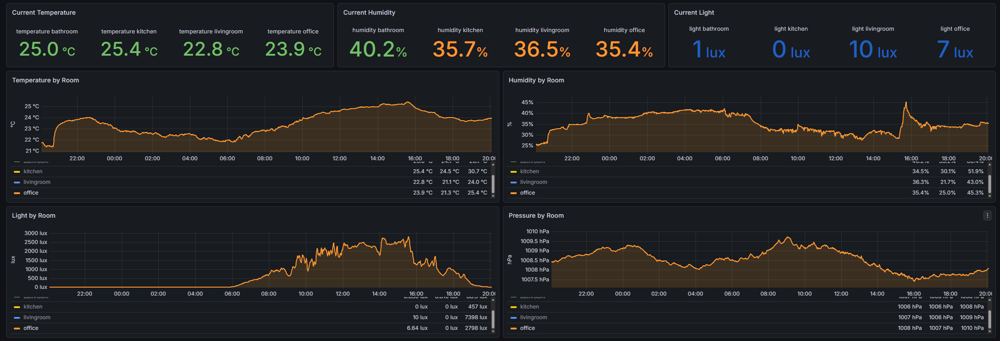

# SmartHomeMonitoring

## About Project
SmartHomeMonitoring is a distributed IoT system designed to continuously track environmental conditions across multiple rooms in a home. Each monitored room is equipped with an ESP32 microcontroller connected to a BME280 sensor (temperature, humidity, atmospheric pressure, altitude) and a BH1750 ambient light sensor. Readings are published periodically over MQTT to a central broker running on a Raspberry Pi.

The data pipeline runs entirely on the local network: a Mosquitto MQTT broker receives incoming measurements, Node-RED routes and preprocesses them, InfluxDB stores the time-series data, and Grafana renders live dashboards - giving a clear, real-time overview of every room's environmental state from a single web interface. Additionally, Tailscale is integrated on the Raspberry Pi, creating a secure VPN tunnel that allows remote access to the dashboards from anywhere in the world.

## Node-RED

Node-RED acts as the central data-routing and processing layer in this system. All sensor readings arriving via MQTT are ingested, transformed, and forwarded to InfluxDB through a set of dedicated flows. Each flow is responsible for a specific part of the pipeline - from parsing room-level data, through aggregating it, all the way to persistence and alerting.

### Room Flow

Each monitored room has its own dedicated flow (office, kitchen, bathroom, living room). The flow subscribes to the room-specific MQTT topic, parses the incoming JSON payload, extracts and labels the individual measurement fields (temperature, humidity, pressure, altitude, light), and passes the structured object downstream for further processing. This flow serves as the entry point for all sensor data coming from the ESP32 installed in a given room.

### Combined Data Flow

The Combined Data Flow merges the outputs from all individual room flows into a single, unified data stream. It joins the payloads from every room, attaches a common timestamp, and produces a consolidated message that contains measurements from all monitored spaces simultaneously. This makes it straightforward to compare readings across rooms and to feed a single, normalised payload into the database writer.

### DB Flow

The DB Flow receives the unified payload from the Combined Data Flow and is responsible for persisting all measurements to InfluxDB. Each field is mapped to the appropriate InfluxDB measurement and tagged with the room name, enabling efficient time-series queries and clean Grafana visualisations. The flow also includes basic error handling - if a write fails, a warning is logged to the Node-RED debug panel.

### Emailing Flow

The Emailing Flow subscribes to the `home/+/status` MQTT topic, which receives the Last Will and Testament (LWT) message published by the broker whenever a device disconnects unexpectedly. When such a message arrives, a function node formats an alert e-mail identifying the affected device and sends it via an SMTP node. This provides immediate notification whenever an ESP32 sensor goes offline, allowing the issue to be detected and addressed quickly.

### Node-RED Dashboard

The built-in Node-RED Dashboard (`node-red-dashboard` palette) provides a lightweight, browser-accessible overview of the current sensor readings. The home tab displays live gauge widgets and line charts for every room, showing temperature, humidity, pressure and light intensity in real time. The dashboard is available on the local network at `http://192.168.1.25:1880/dashboard/home` and is also accessible remotely through the Tailscale VPN tunnel.

## Grafana

Grafana serves as the primary data visualisation layer in this project, querying historical and real-time measurements directly from InfluxDB.

### Full Dashboard

The full Grafana dashboard presents an overview of all monitored rooms in a single view. Each room has its own row containing time-series panels for temperature, humidity, atmospheric pressure, altitude and light intensity. All data is fetched from InfluxDB, and the **time range is fully adjustable** - using the built-in time picker in the top-right corner, you can zoom into the last few minutes or explore weeks of historical data with a single click.

### Room-Level Detail

Selecting a single room (e.g. the office) hides the panel controls and gives a clean, distraction-free view of that room's charts. The graphs update continuously as new readings arrive from the ESP32 sensor via MQTT → Node-RED → InfluxDB. As with the full dashboard, the displayed time window can be freely changed at any time to compare trends across different periods.

## Author
* **Name:** Krzysztof Tomicki
* **Contact:** tomicki.krzysztof.pv@gmail.com
